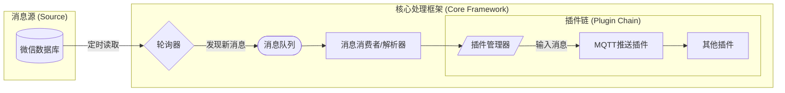

# wechat-listener

> ⚠️ **使用风险警告**
>
> 使用本项目存在微信账号被封禁、功能受限等风险，**项目及作者概不承担任何责任**。
>
> 在使用过程中，请务必遵守微信的各项行为准则，避免违规操作，降低封号概率。
>
> ---
>
> **🙅‍♂️禁止使用范围：**
>
> 本项目**严禁用于营销、发广告等任何企业或商业行为**，仅推荐用于个人学习和技术交流用途。
>
> **☂️隐私与安全声明：**
>
> 本项目**不联网，不收集任何用户数据**，所有运行数据均保留在用户电脑本地。
>
> 本项目**不会对微信数据库进行任何写操作**，不影响微信的正常运行。

<p align="center">
  <a href="https://github.com/LeXrLt/wechat-listener">
    
  </a>
  <a href="LICENSE">
    
  </a>
</p>

> � 一个专注于微信消息监听的 SDK，基于数据库轮询实现零延迟消息获取，支持 MQTT 消息推送和插件扩展。

<p align="center">
  <kbd></kbd>
</p>

## ✨ 特性

* **接收消息零延迟**：基于数据库的监听策略，几乎零延迟接收消息
* **运行时零侵入**：采用只读方式打开微信数据库，零HOOK，降低被检测概率
* **插件化架构**：通过插件系统轻松扩展功能，如 MQTT 消息推送
* **快速启动**：几行代码即可启动消息监听

## 🚀 快速开始

### 1. 安装

**务必使用 Python 3.12**

```bash
pip install -e .
```

### 2. 获取数据库密钥

本项目不提供此工具，可自行通过 GitHub 获取 DbkeyHookCMD.exe 或 DbkeyHookUI.exe 进行获取。获取数据库密钥后，填入配置文件中的 `dbkey`。

### 3. 配置 MQTT（可选）

如需使用 MQTT 消息推送功能，在 `config.yaml` 中配置 MQTT 连接信息：

```yaml
mqtt:
  host: 127.0.0.1
  port: 1883
  username: weixin
  password: YOUR_PASSWORD
```

### 4. "Hello, World"

参考 `config.example.yaml`，生成 `config.yaml`，然后几行代码即可启动监听：

```python
from omni_bot_sdk.bot import Bot

def main():
    bot = Bot(config_path="config.yaml")
    bot.start()

if __name__ == "__main__":
    main()
```

现在，去和你的机器人聊天吧！

## 项目架构



## 📚 内置插件

* **self-msg-plugin** - 阻断自己发送的消息，不再触发后续插件处理
* **block-empty-room-plugin** - 阻断没有群名称的消息
* **push-msg-to-mqtt-plugin** - 将消息推送到 MQTT 服务器

## 🧩 示例

我们提供了一个包含丰富示例的目录，帮助你快速实现各种功能。

你可以在本仓库的 `examples/` 目录下找到所有示例代码。

## 🤝 贡献

我们热烈欢迎任何形式的贡献！无论是提交 Issue、修复 Bug 还是添加新功能。

在开始之前，请先阅读我们的 **[贡献指南 (CONTRIBUTING.md)](CONTRIBUTING.md)**。

开发环境设置：

```bash
# 1. 克隆仓库
git clone https://github.com/weixin-omni/omni-bot-sdk-oss
cd omni-bot-sdk-oss

# 2. 创建并激活虚拟环境 (推荐)
python -m venv venv
source venv/bin/activate # on Windows: venv\Scripts\activate

# 3. 安装开发依赖
pip install -e .

```

## 💀 项目局限性

* 数据获取方案可被检测，目前采用数据库轮询的方案获取最新消息，使用只读模式打开微信的db文件，会出现文件句柄，具体表现和杀毒软件扫描文件应该是类似的。后续会优化，在不读取的时候释放掉句柄。

## ❓FAQ

可以加Omni-bot的开发者交流群，请注明omni-bot，机器人会自动通过，每天自动通过人数有限，请耐心等待

<p align="center">
    
    
</p>

（如果项目对你有用，也可以请我喝杯咖啡 ☕️ ~）

<p align="center">
  <kbd></kbd>
</p>

## 🗺️ 路线图 (Roadmap)

* [ ] 优化消息获取机制，增强反屏蔽能力
* [ ] 增加更多插件
* [ ] 编写测试用例

## 📄 许可证

本项目基于 [GPL-V3](LICENSE) 许可证开源。

## 🌟 Star History

<a href="https://www.star-history.com/#LeXrLt/wechat-listener&Date">
 <picture>
   <source media="(prefers-color-scheme: dark)" srcset="https://api.star-history.com/svg?repos=LeXrLt/wechat-listener&type=Date&theme=dark" />
   <source media="(prefers-color-scheme: light)" srcset="https://api.star-history.com/svg?repos=LeXrLt/wechat-listener&type=Date" />
   
 </picture>
</a>

## ❤️ 致谢与引用

本项目在开发过程中参考和使用了以下开源项目的代码和技术，在此向这些项目的作者和贡献者表示衷心的感谢：

### 微信数据库解析相关

- **[DbkeyHook](https://github.com/gzygood/DbkeyHook)** - 微信数据库密钥获取工具，是本项目运行的前提条件
* **[wechat-dump-rs](https://github.com/0xlane/wechat-dump-rs)** - 基于Rust的微信数据库解析工具，为本项目提供了数据库读取的技术参考
* **[WeChatMsg](https://github.com/LC044/WeChatMsg)** - 微信聊天记录导出工具，提供了微信消息格式解析的重要参考
* **[wechat-dump](https://github.com/ppwwyyxx/wechat-dump)** - 微信数据库导出工具，WXGF格式的解析参考

### 微信文件解析相关

- **[WxDatDecrypt](https://github.com/recarto404/WxDatDecrypt)** - 微信文件解密工具，为图片和媒体文件的解析提供了技术支持

这些优秀的开源项目为 wechat-listener 的开发奠定了重要的技术基础。我们感谢这些项目的开源精神，并承诺在遵循各自许可证的前提下使用这些技术。

## ⚠️ 免责声明

本项目仅供学习和技术交流使用，严禁用于任何商业用途或违反相关法律法规的行为。因使用本项目产生的任何后果，均由用户自行承担，项目作者不承担任何法律责任。
